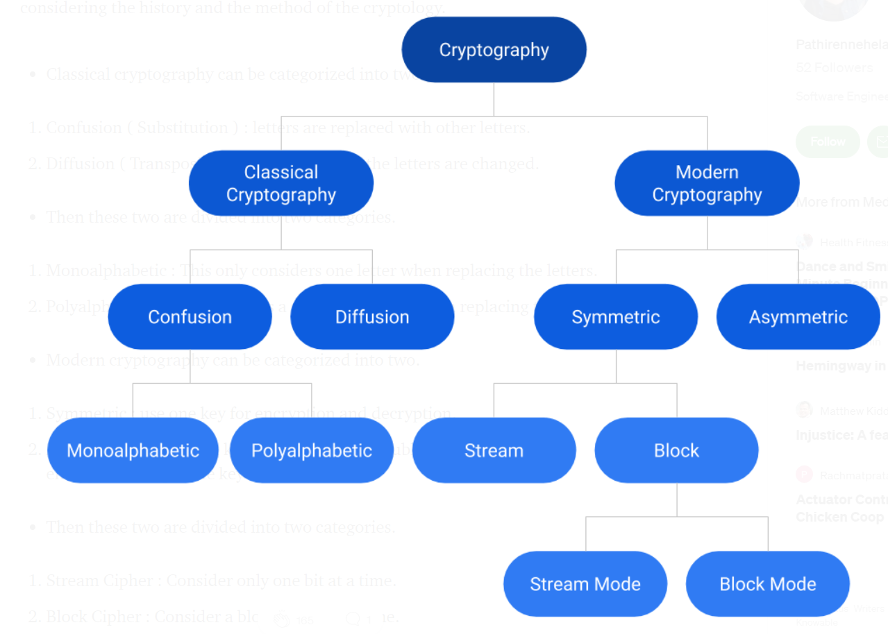
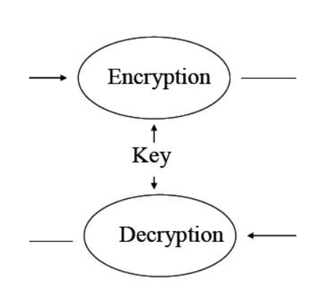

# Getting started with **cryptography**
- This article/readme is based on two medium articles about cryptography
    - click [here](https://medium.com/@nshani/getting-started-with-cryptography-and-key-concepts-5e89c7687939) to read the first article
    - click [here](https://medium.com/@nshani/basic-principles-of-cryptography-9a282e7a2d2d) to read the second article
    
## Cryptology
- Cryptology is the mathematics such as number theory and the applications of formulas and algorithms that act as base of cryptography and crpytanalysis
- Cryptology is the science of secret messages. Anything that has to do with making or breaking codes falls into cryptology's domain.

## What is Cryptography
- Going with the definition which says,
"Cryptography is associated with the process of converting ordinary palain text into unintelligible (unreadable/hard to understand) text and vice-versa.
It is a method of storing and transmitting data in a particular form so that only those for whom it is intended can read and process it"

- In simple words, we change the text in such a way (based on an algorithm) such that only sender and receiver is able to decode it.
- Another important concept that goes with cryptograph is **steganography**

## What is Steganography
- Cryptography -> secret writing
- Steganography  **hidden writing**

- In other words
    - Steganography is the hiding of a secret message within an ordinary messagne and the extraction of it at its destination.
    - Steganography takes cryptography a step farther by hiding an encrypted message so that no one suspects it exists

## More about **cryptography**
### Cryptography provides these qualities for transmitting data
1. Confidentiality
2. Integrity
3. Availability
4. Anonymity
5. Non-repudition or origin and delivery
6. Contract signing
7. Time stamping
8. Key escrow

### Classes of cryptography
1. Classical Cryptography
    - Based on the characters/alphabets
    - Secret writing done manually
2. Modern Cryptography
    - Used with digital computer systems
    - Processes bits/bytes
- Distribution of cryptography considering the history and method of the cryptography

#### Classical cryptography
- It can be classified into two
    1. Confusion (Substitution): letters are replaced with other letters.
    2. Diffusion (Transposition) : the position of the letters are changed

- These two are the divided into two categories:
    1. Monoalphabetic: This only considers one letter when replacicng the letters
    2. Ployalphabetic: This considers a set of characters when replacing the letters
#### Modern cryptography
- It can be categorized into two
    1. Symmetric: use one key for encryption and decryption
    2. Asymmetric: There is a key pair (private and public). Use public key for encryption and private key for decryption
- These two are further divided into two categories
    1. Stream Cipher: Consider only one bit at a time
    2. Block Cipher: Consider a bock of bits at a time

---
## Kerckhoff's principle on cryptography
- Kerkchoff's principle states that,
"a cryptographic system should be designed to be secure, even if all its details, except for the key, are publicaly known"
### basic flow of encryption

### Cryptographic Algorithm and Protocol
- Cryptographic Algorithm: Primitive
    - Primitive: [Cryptographic primitives are well-established, low-level cryptographic algorithms that are frequently used to build cryptographic protocols for computer security systems.](https://en.wikipedia.org/wiki/Cryptographic_primitive)
- Cryptographic Protocol: How to use primitives

- Security only depends on the eys not what happens at the ends.
    - All the cryptographic algorithms are public!.

## Modern Primitives: Two Families
### Symmetric Cryptography

- All keys are known by Alice and Bob
- Either alice or bob can be interchanged as sender or reciever at any time as keys are not bind with the person
### Asymmetric Cryptograhy (Public Key Cryptography)

- Public keys and secret keys
- Secret keys known only by owner
- bob and Alice use different keys
- Simpler protocol, but primitives more difficult to design
---