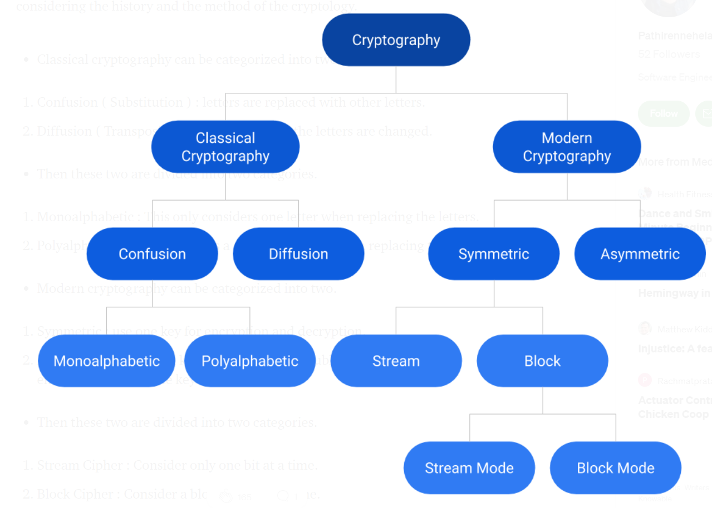

# Getting started with **cryptography**
- This article/readme is based on a medium article about cryptography
    - click [here](https://medium.com/@nshani/getting-started-with-cryptography-and-key-concepts-5e89c7687939) to read the article
## Cryptology
- Cryptology is the mathematics such as number theory and the applications of formulas and algorithms that act as base of cryptography and crpytanalysis
- Cryptology is the science of secret messages. Anything that has to do with making or breaking codes falls into cryptology's domain.

## What is Cryptography
- Going with the definition which says,
"Cryptography is associated with the process of converting ordinary palain text into unintelligible (unreadable/hard to understand) text and vice-versa.
It is a method of storing and transmitting data in a particular form so that only those for whom it is intended can read and process it"

- In simple words, we change the text in such a way (based on an algorithm) such that only sender and receiver is able to decode it.
- Another important concept that goes with cryptograph is **steganography**

## What is Steganography
- Cryptography -> secret writing
- Steganography  **hidden writing**

- In other words
    - Steganography is the hiding of a secret message within an ordinary messagne and the extraction of it at its destination.
    - Steganography takes cryptography a step farther by hiding an encrypted message so that no one suspects it exists

## More about **cryptography**
### Cryptography provides these qualities for transmitting data
1. Confidentiality
2. Integrity
3. Availability
4. Anonymity
5. Non-repudition or origin and delivery
6. Contract signing
7. Time stamping
8. Key escrow

### Classes of cryptography
1. Classical Cryptography
    - Based on the characters/alphabets
    - Secret writing done manually
2. Modern Cryptography
    - Used with digital computer systems
    - Processes bits/bytes
- Distribution of cryptography considering the history and method of the cryptography
